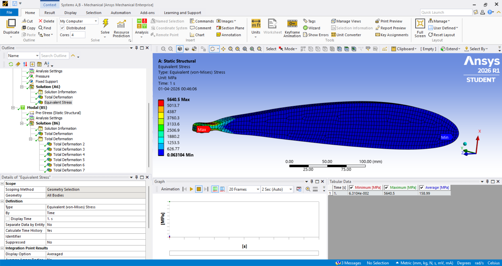
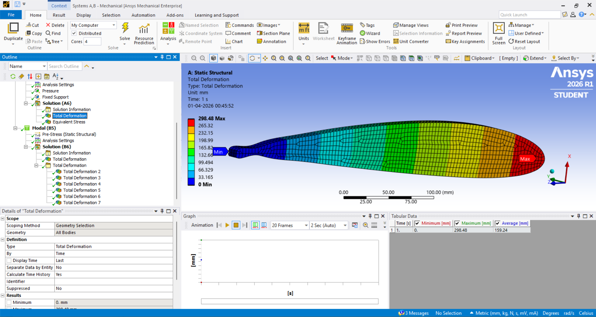
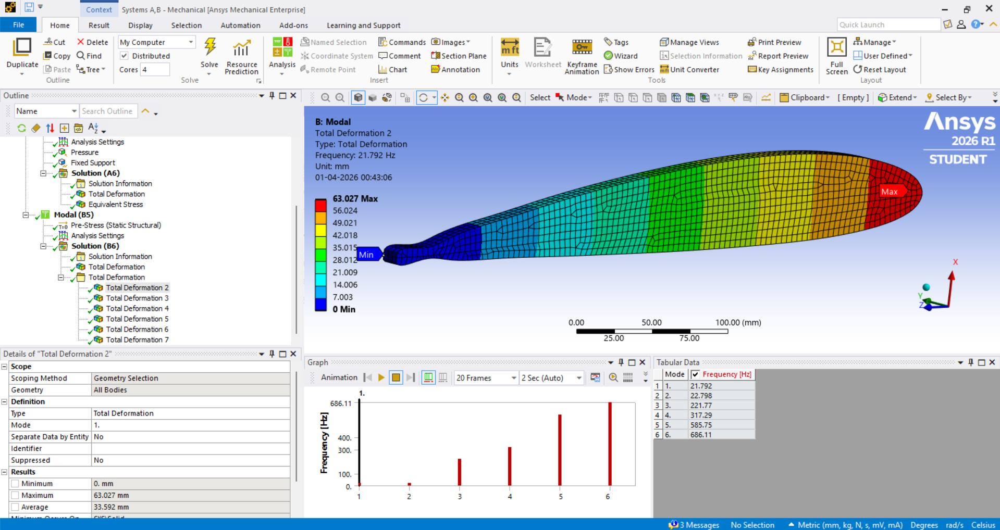

# NACA 2412 Aerofoil Structural & Modal Analysis (ANSYS)

 A Finite Element Analysis (FEA) project demonstrating structural integrity and vibration characteristics of an aerofoil using ANSYS.

### Overview

This project presents a structural and modal analysis of a NACA 2412 aerofoil using ANSYS Workbench 2026 R1.
The objective was to evaluate:
* Stress distribution (Von Mises stress)
* Structural deformation
* Natural frequencies and mode shapes

The study simulates aerodynamic loading on an aluminium alloy wing section.

### Tools & Software

* ANSYS Workbench 2026 R1 (Student Edition)
* ANSYS Mechanical
* SpaceClaim (Python scripting for geometry)
  

### Methodology

## Geometry

* Aerofoil: NACA 2412
* Chord Length: 0.5 m
* Span: 12 mm
* Generated using Python scripting in SpaceClaim

## Material

* Aluminium Alloy
* Young’s Modulus: 71 GPa
* Yield Strength: 280 MPa

## Boundary Conditions

* Fixed support at root
* 5000 Pa pressure on upper surface (simulating lift)

## Static Structural Results

| Parameter            | Value      |
| -------------------- | ---------- |
| Max Von Mises Stress | 5640.5 MPa |
| Max Deformation      | 298.48 mm  |
| Avg Stress           | 158.99 MPa |

#Key Insight:
Stress at the root exceeds yield strength → structural failure expected → redesign required.

## 📈 Modal Analysis Results

| Mode | Frequency (Hz) | Description    |
| ---- | -------------- | -------------- |
| 1    | 21.79          | 1st bending    |
| 2    | 22.79          | 2nd bending    |
| 3    | 221.77         | Higher bending |
| 4    | 317.29         | Torsional      |
| 5    | 585.75         | Higher mode    |
| 6    | 686.11         | Complex mode   |

#Key Insight:
Natural frequencies are critical to avoid resonance and aeroelastic flutter.

## Results

### Von Mises Stress

### Total Deformation

### Mode Shape

## Key Learnings

* High stress concentration occurs at fixed root (cantilever behavior)
* Thin structures lead to excessive deformation
* Modal analysis is critical for flutter prevention
* Mesh size optimization is required due to ANSYS student license limits
  
## Challenges Faced

* SpaceClaim scripting errors (Python vs .NET type mismatch)
* Mesh size limitations due to student license constraints
* Geometry scaling and meshing refinement
  
## Applications

* Aircraft wing structural design
* Aeroelastic flutter analysis
* Wind turbine blade design
* Structural health monitoring
  
## Project Files

* Detailed project report (PDF)
* Simulation result images

